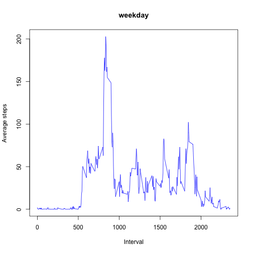

Course Project 1 Overview: 
- Read in file
- Calculate mean number of total steps per day taken with graphic output 
- Calculate and plot average daily activity pattern by interval
- Imput misssing values in dataset and recalculate of mean and median activity
- Calculate and plot average daily activity pattern by interval comparing of activity pattern on weekdays vs. weekend

## Loading and preprocessing the data


```r
file_in <- "activity.csv" 
activity <- read.csv(file_in)
```


## What is mean total number of steps taken per day?


```r
 #split file by date into list
    StepsByDay <- with(activity, split(steps, date))
    #apply sum function over each element (day) in list for total steps
    #return vector for plotting & later calcs
    SumPerDay <- sapply(StepsByDay,sum, na.rm=TRUE)
    #apply mean function over each element (day) in list for average steps/day
    #return vector for plotting & later calcs
    MeanPerDay <- sapply(StepsByDay,mean)
    meanSPD <- mean(MeanPerDay, na.rm=TRUE)
    medianSPD <- median(MeanPerDay, na.rm=TRUE)

    #plot graph
    hist(SumPerDay, col = "green", main = "Total Steps Histogram", xlab = "Total Steps per Day")
```

 

Mean number of steps per day is 37.383. Median number of steps per day is 37.378

## What is the average daily activity pattern?

```r
dailypattern <- function(activity,maintitle,x_label,y_label) {
    #split data by interval (drop date)
    aveAct <- with(activity, split(steps, interval))
    
    # calculate mean steps over all days at each interval
    meanperday <- sapply(aveAct, mean, na.rm=TRUE)

    # get intervals from named vector
    n <- names(meanperday)
    
    # convert character names to numeric
    interval <- as.numeric(n)
    
    # create data frame  with means and intervals
    ms <- as.vector(meanperday)
    mpd <-data.frame(interval = interval, meansteps = meanperday)
    
    #plot mean steps vs interval

    plot(mpd$interval, mpd$meansteps, type = "l", col = "blue", main = maintitle, xlab = x_label, ylab = y_label)
    
    #determine index of max mean steps
    mval <- which.max(mpd$meansteps)
    #determine value of max mean steps
    msteps <- mpd$meansteps[mval]
    #determine interval of max mean steps
    minterval <- mpd$interval[mval]
    out <- paste0(maintitle, ": The maximum mean of ", msteps, " steps is at interval ", minterval, ".")
    out
}
```


```r
 dailypattern(activity,"Average daily pattern","Interval", "Average Steps")
```

 

```
## [1] "Average daily pattern: The maximum mean of 206.169811320755 steps is at interval 835."
```


```r
 ## function for later use - mean and median stats
stepstats <- function(activity) {
    #split file by date into list
    StepsByDay <- with(activity, split(steps, date))
    #apply sum function over each element (day) in list for total steps
    #return vector for plotting & later calcs
    SumPerDay <- sapply(StepsByDay,sum, na.rm=TRUE)
    #apply mean function over each element (day) in list for average steps/day
    #return vector for plotting & later calcs
    MeanPerDay <- sapply(StepsByDay,mean)
    meanSPD <- mean(MeanPerDay, na.rm=TRUE)
    medianSPD <- median(MeanPerDay, na.rm=TRUE)
    
    #print mean and median number of steps
    out <- paste0("Mean steps per day = ", meanSPD, ". Median steps per day = ", medianSPD)
    out
}
```
## Imputing missing values

```r
    #determine total number of observations
    a<-dim(activity)
    totobs <- a[1]
    # determine if steps = NA in dataset
    missing <- is.na(activity$steps)
    # convert logical to count of NAs
    totmissing <- sum(missing)
    complete <- totobs - totmissing
```

The number of NAs in the dataset is 2304 out of 17568 observations.


```r
    # copy dataset
    new_activity <- activity
    
    # make a list of daily means to replace NAs in new data set if needed
    
    temp1 <- with(new_activity, split(steps, date))
    daymeans <- lapply(temp1,mean)
    
    # loop thru TRUE missing entries and assign NA to 0 or daily mean
    
    for (i in 1:length(missing)){
        if(missing[i] == TRUE) {
            #get date as character vector
            dateof <- as.character(activity$date[i])
            #if mean value of that date is NA use mean of zero
            #else use daily mean to replace NA value
            if( is.na(daymeans[dateof]) ) {
                new_activity$steps[i] = 0
                # print(paste(i, dateof))
                } else {
                    new_activity$steps[i] = daymeans[[dateof]]
                    }
        }
    }

    # new_activity = dataset free of NAs
    
    # split file by date into list
    StepsByDay <- with(new_activity, split(steps, date))
    
    # apply sum function over each element (day) in list for total steps
    # return vector for plotting & later calcs
    SumPerDay <- sapply(StepsByDay,sum, na.rm=TRUE)
    
    #apply mean function over each element (day) in list for average steps/day
    #return vector for plotting & later calcs
    MeanPerDay <- sapply(StepsByDay,mean)
    meanSPD <- mean(MeanPerDay, na.rm=TRUE)
    medianSPD <- median(MeanPerDay, na.rm=TRUE)

    #plot graph of dataset with imputed values 
    hist(SumPerDay, col = "red", main = "Total Steps Histogram - with imputed values", xlab = "Total Steps per Day")
```

 

Since entire days had NA values, a step value of 0 replaced the NAs. The only change to the histogram would be a slight increase in the frequency of the bar for a low number of steps (0-500)

```r
    stepstats(new_activity)
```

```
## [1] "Mean steps per day = 32.4799635701275. Median steps per day = 36.09375"
```
The mean and mediam values for steps per day with imputed values are less that the previous calculation. This makes sense since, in the previous calculation,  NA values were removed before the calculation resulting in a data set of 15264 observations for the mean and median calculations. When the missing values are imputed, there are 2304 more observations.

## Are there differences in activity patterns between weekdays and weekends?


```r
new_activity$Date <- as.Date(as.character(new_activity$date))
    new_activity$weekday <- weekdays(new_activity$Date)

    weekday <- "weekday"
    weekend <- "weekend"
    x <- "Interval"
    y <- "Average steps"
    new_activity$weekday <-sub("Saturday|Sunday","weekend", new_activity$weekday,)
    new_activity$weekday <-sub("Monday|Tuesday|Wednesday|Thursday|Friday","weekday", new_activity$weekday,)
    
    #treat weekend and weekday as factors
    new_activity$weekday <- as.factor(new_activity$weekday)
    
    # subset data frames by factors
    day_activity <- subset(new_activity, new_activity$weekday =="weekday")
    end_activity <- subset(new_activity, new_activity$weekday =="weekend")
    dailypattern(day_activity, weekday,x,y)
```

 

```
## [1] "weekday: The maximum mean of 202.888888888889 steps is at interval 835."
```


```r
 dailypattern(end_activity,weekend,x,y)
```

 

```
## [1] "weekend: The maximum mean of 153.125 steps is at interval 915."
```
There is a clear difference in average weekday vs. weekend activity patterns. There appears to be more variation in activity during intervals throughout the day on weekends though the mean number of steps taken on the weekend is less than during the weekdays.
